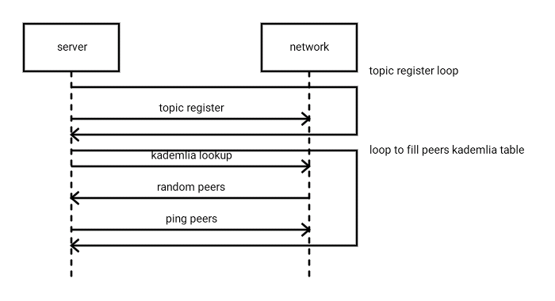
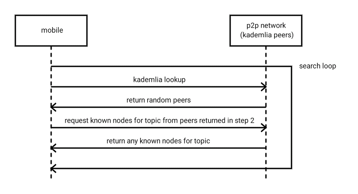

Discovery v5 usage in status-go
===============================

Capability-based discovery will be using two mechanisms from discv5 go-ethereum
implementation. Topic registration and topic search.

Registration
------------

Every topic registration spawns two interdependent loops:
1. Node that registers itself as a topic provider will periodically send topics
to the peers.
2. Second loop advertises itself to peers in the network.
It does so by requesting peers from known peers and sending ping request to them.
As a result all peers in the network will learn about new node faster.

Search
------

Search request spawns single loop for every searched topic. This loop
request peers from known peers (starting from one-self) and then requests
from them nodes that are registered as a topic provider.

We can control how often this loop wil run, more about it in the next section.

Peer pool in status-go
----------------------

Peer pool uses search mechanism described above to find peers in a timely manner
without using a lot of resources in the long run. It achieves it by introducing
two modes of synchronization:

1. Fast mode.

Peer will run search loop quite often (every 500ms at the time of writing) with the
goal to visit as much nodes as possible and once it will find minimum amount of
peers with required capability it will swich to slow mode.

1. Slow mode.

This mode might be useful to get information about new peers that can be used
later if initial set of peers disappears. Should run once in a 10m-30m.

However finding peers even with fast mode can take noticeable amount of time,
which is fine if node is a long-running, but will be a huge problem on a mobile
device. To workaround such problem we will introduce a leveldb cache that will
maintain a list of peers that was used by a device before it went offline.

Another important detail of a peer pool is a support of min and max amount of peers:

- min is required to switch from fast to slow sync mode
- max is an upper limit that can be used by a single node