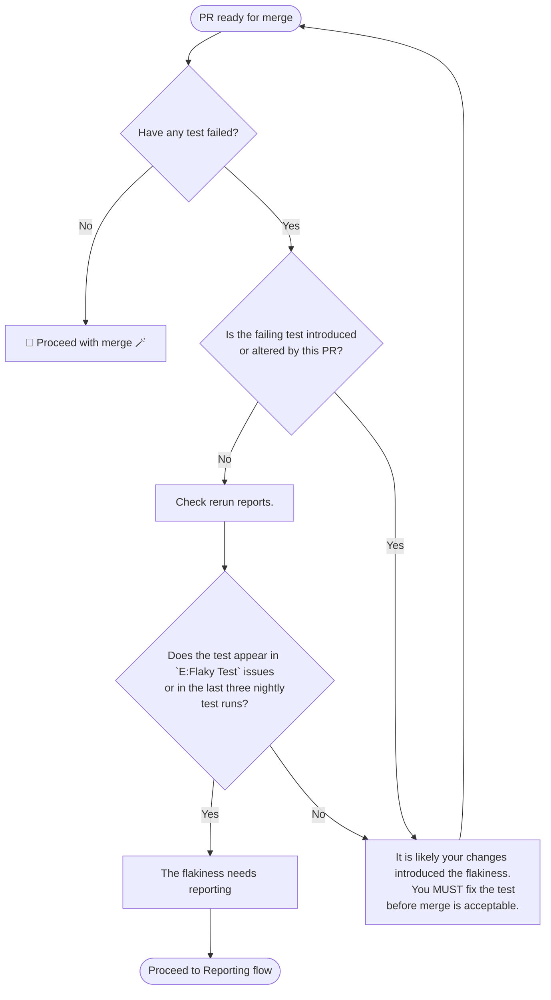
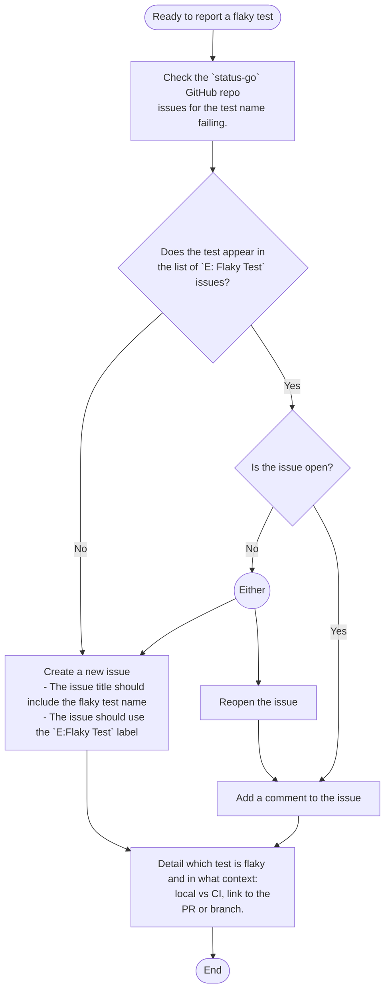

# `status-go` Test Policy

## Purpose

This policy defines the requirements and guidelines for testing within the `status-go` repository. It aims to ensure all new functionality is introduced with robust, reliable, and repeatable tests 
while preventing flaky tests from being merged into the codebase. This aligns with Policy Zero’s principles of transparency, collaboration, and quality assurance in the development process.

## Submitting and Maintaining the Test Policy

- Any individual MAY propose amendments to this policy.
- Proposed changes MUST be submitted as a pull request (PR) to the `_docs/policies` directory in the `status-go` repository.
- The PR MUST include a brief justification for the amendment, answering: "Why is this change needed?"
- The PR MUST follow the [Review and Approval Process](./introduce-policy.md#review-and-approval-process) outlined in Policy Zero.

## Creating Tests

- All new functionality MUST be introduced with tests that:
  - Prove that the functionality performs as described
  - Can be falsified
  - Are resistant to fuzzing
- All new `functional tests` MUST BE validated via a minimum of 1000 test runs.
  - This can be achieved using the `-count` or `-test.count` flag with the test command, e.g., `-count 1000` / `-test.count 1000`.
  - Where the CI cannot support this workflow automatically, the developer MUST perform validation tests via local testing.
    - `TODO` Add link to issue for CI automation of validation test runs of new `functional tests`.
  - Ensuring that the test passes consistently every time gives confidence that the test is not flaky.

## Flaky Tests

Flaky tests are defined as tests that fail intermittently.

- All flaky tests / failing tests MUST be resolved.
- No flaky tests may be introduced into the codebase.

### Steps to Resolving or Reporting Flaky Tests

#### Is it Me?
Determine who caused the flaky test.

- Is a new test you’ve written flaky or failing?
  - It was you.
  - You MUST fix the test before merge is acceptable.
- Has an existing test become flaky?
  - Check rerun reports. `TODO` Add link to rerun reports.
    - If the test does not appear in https://github.com/status-im/status-go/labels/E%3AFlaky%20Test or in the last three nightly test runs, it is most likely that the flakiness was introduced by 
your changes and needs to be addressed before proceeding with the merge.
    - Otherwise, the test is already documented as a flaky test (appears in the GitHub issues or in the nightly test runs), proceed to below.

#### Reporting Flaky Tests
If an old test fails and/or seems flaky either locally or in CI, you MUST report the event.

- Check the `status-go` GitHub repo issues for the test name(s) failing.
- If the test appears in the list of flaky test issues:
  - If the issue is open:
    - Add a comment to the issue.
    - Detail that you have experienced the test being flaky and in what context (local vs CI, link to the PR or branch).
  - If the issue is closed:
    - Reopen the issue OR create a new issue referencing the previous issue.
      - Either is fine, use your best judgment in this case.
    - Detail that you have experienced the test being flaky and in what context (local vs CI, link to the PR or branch).
- If the test does not appear in the list of flaky test issues:
  - Create a new issue.
    - The issue title should include the flaky test name.
    - The issue should use the https://github.com/status-im/status-go/labels/E%3AFlaky%20Test label.
  - Detail that you have experienced the test being flaky and in what context (local vs CI, link to the PR or branch).

## Policy Amendments and Archival

- Amendments:
  - This policy MAY be amended at any time.
  - Amendments MUST be submitted via a PR to the `status-go` repository.
- Archival:
  - This policy MAY be archived if it becomes obsolete or replaced by newer policies.
  - Archival MUST be performed by submitting a PR that moves the policy to `_docs/policies/archived`.
- The PR MUST include a rationale for the proposed amendment or archival in the PR description.
- The PR MUST follow the [Review and Approval Process](./introduce-policy.md#review-and-approval-process) outlined in Policy Zero.

