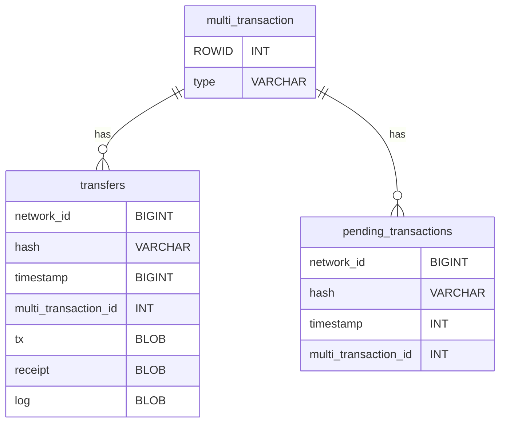

# DB extension and refactoring for activity

## Work in progress

|               | Buy            | Swap           | Bridge        | Send/Receive  |
| ------------- | -------------- | -------------- | ------------- | ------------- |
| Activity data | ~~API~~ ~~DB~~ | ~~API~~ ~~DB~~ |  _API_  _DB_  |  _API_  _DB_  |
| Raw data      | ~~API~~ ~~DB~~ | ~~API~~ ~~DB~~ |  _API_  _DB_  |  _API_  _DB_  |
| Pending data  | ~~API~~ ~~DB~~ | ~~API~~ ~~DB~~ |  _API_  _DB_  |  _API_  _DB_  |

Legend:

- ~~API~~ - not much or at all provided
- _API_ - partially provided
- API - complete

### Summary

Improve on the identified limitations

- [ ] Missing filtering data
- [x] Missing cached (not extracted as a column)
  - Extracting the data from the raw data is expensive but might be negligible given that usually we should not expect more than 20 entries per second in the worst case scenario.
- [x] Table extensions
  - ~~Activity specific info in activity data store (multi_transaction table)~~
  - Activity specific info in in the transactions data store (transfers table)

### Missing data

Filter requirements

- [x] Activity operation status
  - [x] `pending`: have to aggregate for `Buy`, `Swap`, `Bridge`
    - already there for `Send`, `Receive`
  - [x] `complete`: only extract and check for `status` in the `receipt` for `Send`, `Receive`
    - For complex operations aggregate the `complete` status `Buy`, `Swap`, `Bridge`
  - [x] `finalized`: similar to `complete`  for `Send`, `Receive`
    - all sub-transactions are `complete` for `Buy`, `Swap`, `Bridge`
  - [x] `failed`: extract from `status` for all sub-transactions
- [ ] `chainID`: aggregate data for activity entries `Bridge`, `Buy`, `Swap`
- [ ] `tokenCode` for activity entries `Send`, `Receive`
  - For `Bridge` its already there and `Buy`, `Swap` is coming soon
- [ ] `collectibles`: require adding collectible attributes to activity data (probably `token_address` and `tokenId`)

UX requirements

- [x] `status`: for status icon and label
- [ ] `chainIDs`: for chain icons
  - Missing for `Bridge`, `Buy`, `Swap`
- [ ] `amount`s: add to the activity.Entry
  - already in DB
- [ ] `tokenCode`s: add to the activity.Entry
  - already in DB
- [ ] `to`/`from`/`owner`: add to the activity.Entry
  - already in DB, coming soon
- [ ] `tokenIdentity`: collectible is missing (`chainId`, `address`, `tokenId`)
  - `tokenCode` should be covering fungible operations
- [x] `identity`: for all the sources
- [x] `type`: for the main icon and label
- [x] `time`: timestamp

### Refactoring

Extend `entry.nim:ActivityEntry` and `activity.go:Entry` with presentation layer data

- [ ] `activityType`: instead of the current `MultiTransactionType`
- [x] `status`: for status icon and label

## Current state

### Transfers Table

The `transfers` transactions raw data

- Transaction identity: `network_id`, `hash`, `address`
  - Implementation by `sqlite_autoindex_transfers_1` unique index
- `multi_transaction_id`: `multi_transaction` entries to `transfers` entries mapping (one to many)
- Raw data:
  - `tx` transaction
  - `receipt`: transfer receipt

### Multi-Transaction Table

Represented by `multi_transaction`

Responsibilities

- UX metadata for transactions originating from our APP.
  - `from_address`, `to_address`
  - `from_asset`, `to_asset`
  - `from_amount`, `to_amount` (token codes)
  - `type` identifies the type (initially only Send and Bridge)
  - `timestamp` the timestamp of the execution
- Multi-transaction to sub-transaction mapping
  - The `multi_transaction_id` in the `transfers` and `pending_transaction` table corresponds to the `ROWID` in the `multi_transactions`.

### Pending Transactions Table

The `pending_transactions` table represents transactions initiated from the app

- Transaction identity
  - `network_id`, `hash`
    - implemented by the `sqlite_autoindex_pending_transactions_1` index
    - Note how this is different from the `transfers` table, where the `address` is also part of the identity.
- `timestamp`: The timestamp of the pending transaction.
- `multi_transaction_id`: `multi_transaction` entries to `pending_transactions` entries mapping (one to many)

### Schema

Relationships between the tables

### Dropped tasks

Dropped the DB refactoring and improvements after further discussion and concerns

- [x] Terminology proposal
  - [x] using `transactions` instead of `transfers` for the raw data
  - [x] using `activity` instead of `multi-transaction` to better match the new requirements
  - [x] Convert JSON blobs into structured data

Dropped benchmark performance and move on using theoretical knowledge by adding indexes for what we know only
Will leave the performance concerns for the next milestone

- [ ] Joining DBs
- [ ] One activity DB for all require metadata
  - Pros:
    - Faster to query (don't know the numbers)
    - Simpler query will decrease maintenance
  - Cons:
    - have to migrate all data, extract and fill the activity on every download of updates for all activities
- [ ] Keep only filter specific metadata in the Activity DB
  - Pros:
    - Less changes to migrate existing data. Still have to maintain activity filtering specific data
  - Cons:
    - Slower to query (don't know how much yet)
    - Complex query increases maintenance

